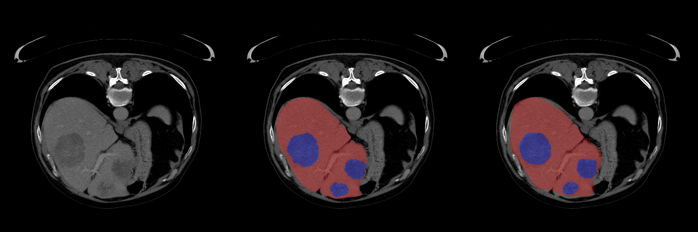

# MedicalImageSegmentation-Pytorch
Tumor segmenting volumatric CT data of liver tumors

A visualization of input, end2end prediction of the pretrained model and Ground truth of a sampple from LiTS2017


# Steps for training/testing pretrained models on LiTS2017
This repo segments CT in two steps:
- 1: Localization: A liver-localization CNN that gets the entire CT volume roughly segments the liver area.
- 2: Segmentation: Two a multiclass CNN on volumes cropped around the liver to fine-segment the liver and tumors

## Step 1: Download LiTS dataset
Download dataset ~50GB from kaggle 
- [LiTS2017 part1](https://www.kaggle.com/andrewmvd/liver-tumor-segmentation)
- [LiTS2017 part2](https://www.kaggle.com/andrewmvd/liver-tumor-segmentation-part-2)

Data should look like this:
```
LiTS2017

└───train
│   └───ct
│       │   volume-0.nii
│       │   volume-1.nii
│       │   ...
│       │   volume-131.nii
│   └───seg
│       │   segmentation-1.nii
│       │   segmentation-2.nii
│       │   ...
│       │   segmentation-131.nii
└───test
│   └───ct
│       │   test-volume-0.nii
│       │   test-volume-1.nii
│       │   ...
│       │   test-volume-69.nii
```

## Step 2: Preprocess data
In this step we prepare the data for training.
- 1: Loclization CNN does not need the full resolution of the volumes so we create a light low resolution replica of the dataset
- 2: We crop volumes around the liver for the segmentation network.
```
cd datasets
python3 preprocess_dat.py <LiTS root dir>
cd ..
```
Do the same for both the train and the test folders.
You should now have tow additional folders in the 'datasets' directory with the same file structure as the original dataset

## Step 3 (Optional) Train models:
Edit scripts/train_loclization_net.py and scripts/train_multiclass_segmentation.py to change model type dataset path or other 
training configurations.

train each model with its script

```
pytnon3 scripts/train_loclization_net.py
pytnon3 scripts/train_multiclass_segmentation.py
```
you should now have a new directory with trained checkpoints for the models


## Step 4 (Optional) Download pretrained models

Download the 'trained_models' folder from [this link](https://drive.google.com/drive/folders/1y-fZWUCsae2gzSXOkeVutH925Q0URfTN?usp=sharing)

and place it in the main folder

## Step 5 Test trained model
Run
```
pytnon3 scripts/test.py <trained model dir> --checkpoint_name <checkpoint file name> --debug
```
This will run the trained model on the validation set compute the average dice score and dump debug images.

## Step 6 End to end inference
Now that we have trained localization and segmentation models we can use them for end to end inference or testing.

### Inference on test set:
```
Python3 inference.py <path to ct> 
    <path to LiTS2017 test/ct folder> 
    --localization_model_dir <path to localization model dir> 
    --segmentation_model_dir <path to segmentation model dir>
```
This will create predicted segmentation volumes in a new directory 'end2end_prediction' with nii volumes that are ready to 
be compressed and submitted to 
[LiTS2017](https://competitions.codalab.org/competitions/17094 )

### End2End evaluation on validation data

Running
```
Python3 inference.py <path to ct> 
     <path LiTS2017 train/ct folder> 
    --gt_dir <path LiTS2017 train/seg folder> 
    --localization_model_dir <path to localization model dir> 
    --segmentation_model_dir <path to segmentation model dir>
```
Will create end2end debug images and print the final score of inference on the validaion set

# Step 6 End to end inference


# Experiment with classical method
set the path in classic_methods/thresholding.py to unprocessed LiTS root dir
run
```
cd classic_methods
python3 thresholding.py
```


# Credits
I consoluted the follwing repos:
- https://github.com/milesial/Pytorch-UNet
- https://github.com/mattmacy/vnet.pytorch
- https://github.com/assassint2017/MICCAI-LITS2017
- https://github.com/nexus-kgp/adseg
- https://github.com/navamikairanda/R2U-Net
